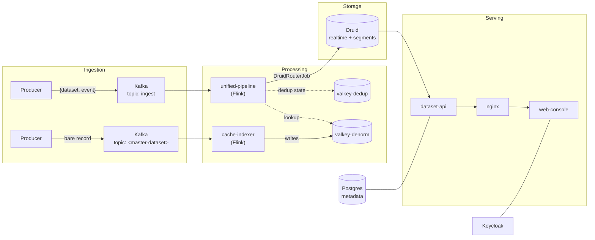

# Obsrv on Docker Compose

A local, single-machine Obsrv stack derived from `helmcharts/`. Every value here
traces back to a chart; where something had to change to work outside
Kubernetes, the reason is in a comment next to it.

**Start here:**

| I want to… | Go to |
|---|---|
| Get it running | [1. Prerequisites](#1-prerequisites) → [2. Setup](#2-setup) |
| Understand what the pieces are | [3. Components](#3-components) |
| Know how fast it is | [4. Performance](#4-performance) |
| Measure it myself | [5. Running the benchmarks](#5-running-the-benchmarks) |
| Understand a design choice | [6. How this maps to the charts](#6-how-this-maps-to-the-charts) |
| Debug something that won't work | [7. What does not work here](#7-what-does-not-work-here) |

Deeper detail lives in linked companion docs rather than here:
[design rationale](../docs/obsrv-local-docker-compose.md) ·
[ingest benchmark results](docs/benchmark-results.md) ·
[query benchmark results](docs/query-benchmark-results.md) ·
[benchmark operating guide](benchmark/AGENTS.md) ·
[load-test guide](benchmark/loadtest/README.md)

---

# 1. Prerequisites

| Requirement | Value | Why |
|---|---|---|
| **Docker Desktop** (or Docker Engine + Compose v2) | any recent version | `docker compose` v2 syntax throughout |
| **Memory allocated to Docker** | **10 GB minimum** | stack measures ~7.0 GB; the rest is headroom, not slack |
| **CPU allocated to Docker** | 4 cores | fewer works but the Flink pipeline gets starved |
| **Disk** | ~15 GB free | images are large; five are amd64-only |
| **Platform** | arm64 (Apple Silicon) or amd64 | five images run under emulation on arm64 — see [Platform](#platform) |
| **Port Availability** | `3000`, `5432`, `6379`, `6380`, `8000`, `8080`, `8081`, `8181`, `8182`, `8888`, `9090`, `29092` | verify no local service (e.g. host Postgres/Redis) occupies these ports |
| `python3` | 3.8+, stdlib only | only needed for the benchmark harness |

Check Docker resources & port availability:

```bash
docker info --format 'mem={{.MemTotal}} cpus={{.NCPU}}'
lsof -i :3000 -i :5432 -i :6379 -i :6380 -i :8000 -i :8080 -i :8081 -i :8181 -i :8182 -i :8888 -i :9090 -i :29092 -sTCP:LISTEN
```

**10 GB against a measured 7.0 GB is deliberate.** The Flink taskmanagers and
the Druid indexer grow once data flows. Running this stack on a VM sized close
to its measured floor has crashed the Docker daemon outright, taking every
container down at once. If you cannot spare 10 GB, trim `COMPOSE_PROFILES` —
see [Memory](#memory-the-binding-constraint).

---

# 2. Setup

```bash
cd local-compose
cp .env.example .env                # once: ports + which profiles come up

# once: create the RSA keypair the token script converts -- it does not
# generate these itself, and fails with "missing secrets/private.pem" without them
mkdir -p secrets
openssl genrsa -out secrets/private.pem 2048
openssl rsa -in secrets/private.pem -pubout -out secrets/public.pem

./scripts/gen-token-env.sh          # once: PEM keypair -> secrets/tokens.env
docker compose up -d
docker compose logs -f flyway keycloak-init oauth-admin-sync kafka-topics-init submit-ingestion
```

Wait for those five one-shot containers to exit cleanly, then open
**http://localhost:8080/console** and log in as `obsrv_admin` / `enDoPvTAxFSd`.

**Don't skip the `.env` copy.** `.env` is gitignored so local port changes stay
local, and every variable in it except `COMPOSE_PROFILES` has a default baked
into `docker-compose.yaml`. `COMPOSE_PROFILES` is read by the Compose CLI itself
rather than by the compose file, so without `.env` it is simply unset —
`docker compose up -d` then brings up the control plane alone, with no Druid and
no Flink, and publishing a dataset fails in confusing ways.

Change `HTTP_PORT` in `.env` if 8080 is taken — it is one variable because it
feeds the Keycloak redirect URI and the console's own base URL as well as the
nginx binding.

## Prove it works

`scripts/sample-dataset.sh` creates a dataset, publishes it, pushes events and
**asserts on the read-back** — not on the publish succeeding, which is the part
that can pass while nothing actually flows. Three modes, in dependency order:

```bash
./scripts/sample-dataset.sh event  demo_events  1000   # -> 1000 rows in Druid
./scripts/sample-dataset.sh master demo_master    50   # -> 50 keys in Valkey
./scripts/sample-dataset.sh denorm demo_joined   200   # -> 200 rows, joined
```

`denorm` needs a live, populated master to join against — `demo_master` by
default, or set `MASTER_DS`. It is the only mode that exercises both Flink jobs
at once, and the only one that proves the master path is useful rather than
merely populated. Read the script before writing your own producer: the event
envelope is **not** the same for the two dataset types, and getting it wrong
fails every record with an error that points somewhere else. See
[Master datasets](#master-datasets-the-event-shape-is-not-the-same-as-an-event-datasets).

## Endpoints

| | |
|---|---|
| Console | http://localhost:8080/console |
| Keycloak | http://localhost:8080/auth (master admin `admin` / `admin123`) |
| dataset-api | http://localhost:3000 |
| command-api | http://localhost:8000 |
| Druid console | http://localhost:8888 (`admin` / `admin123`) |
| Flink UI — unified-pipeline | http://localhost:8181 |
| Flink UI — cache-indexer | http://localhost:8182 |
| Kafka from the host | `localhost:29092` |
| Postgres | `localhost:5432`, `postgres` / `postgres` |

## Reset

```bash
docker compose down -v      # -v also drops the schema, so flyway reruns
```

---

# 3. Components

## The data path



**Event datasets** go through `unified-pipeline` and land in Druid, where they
are queryable. **Master datasets** go through `cache-indexer` and land in Valkey,
where they exist only to be joined against — they have no Druid datasource, which
is why the console reports 0 events and 0 bytes for them ([details](#what-does-not-work-here)).

The five pipeline stages every event passes through are: **extract → validate →
deduplicate → denormalize → transform**, then the terminal `DruidRouterJob` stage
writes to Druid and emits the system event that feeds the console's counters.

## Services by role

| Role | Services | Profile | What it does |
|---|---|---|---|
| **Ingestion buffer** | `kafka` (KRaft) | always | 23 explicit topics, 4 partitions each |
| **Processing — events** | `unified-pipeline-{jobmanager,taskmanager}` | `flink` | validate, dedup, denorm, transform, route to Druid |
| **Processing — master data** | `cache-indexer-{jobmanager,taskmanager}` | `masterdata` | writes master records into Valkey for denorm lookups |
| **Pipeline state** | `valkey-dedup`, `valkey-denorm` | always | dedup keys; master-data cache |
| **Realtime store** | `druid` (5 roles, 1 container), `zookeeper` | `druid` | ingestion, segments, SQL query |
| **Metadata** | `postgres` | always | datasets, datasources, system settings |
| **APIs** | `dataset-api`, `command-api` | always | dataset CRUD + query-out; publish workflow |
| **Auth** | `keycloak` | always | realm `obsrv`, client `obsrv-console` |
| **UI / edge** | `web-console`, `nginx` | always | console; Kong stand-in |
| **Observability** | `prometheus`, `node-exporter` | `metrics` | container and host metrics |

**17 long-running containers** with the default profiles, plus five one-shot
bootstrap containers that run once and exit — watch these if `up` misbehaves:

| One-shot | Does |
|---|---|
| `flyway` | renders and applies the repo's real migrations |
| `keycloak-init` | creates realm `obsrv`, client `obsrv-console`, one user |
| `oauth-admin-sync` | points the `oauth_users` admin row at the Keycloak user id |
| `kafka-topics-init` | creates all 23 topics explicitly |
| `submit-ingestion` | submits the `system-events` Druid supervisor (feeds console counters) |

## Profiles

`COMPOSE_PROFILES` in `.env` controls what comes up. Default is
`druid,flink,masterdata,metrics`.

| Selection | Measured anon | What it gives you |
|---|---|---|
| Control plane only (no profiles) | ~2.2 GB | console, auth, APIs, Kafka, Postgres |
| `+ druid` | ~4.8 GB | the above plus a queryable realtime store |
| `+ druid,flink,metrics` | ~5.8 GB | the full event-dataset path, end to end |
| `+ masterdata` (default) | ~7.0 GB | adds master datasets / denormalization |

`cache-indexer` is behind its own profile because it only handles master
datasets — its config is `dataset.type = "master-dataset"` reading the
`masterdata.*` topics. Plain event datasets go entirely through
`unified-pipeline`, so most first-time users never need it.

## Memory: the binding constraint

Not CPU. Measured after running the ingest → query path, so these include real
ingestion rather than idle.

Numbers are cgroup `anon` (`/sys/fs/cgroup/memory.stat`), not `docker stats`.
**`docker stats` counts page cache**, which for Postgres and Keycloak is over
100 MB of pure noise that the kernel reclaims on demand — use `anon` when
deciding how much RAM the stack actually needs.

| Container | anon (MiB) |
|---|---|
| druid (5 JVMs in one container) | 2562 |
| unified-pipeline taskmanager | 924 |
| cache-indexer taskmanager | 655 |
| cache-indexer jobmanager | 553 |
| unified-pipeline jobmanager | 549 |
| keycloak | 489 |
| kafka | 404 |
| dataset-api | 309 |
| web-console | 228 |
| prometheus | 173 |
| zookeeper | 78 |
| command-api | 74 |
| postgres | 22 |
| valkey ×2, node-exporter, nginx | ~30 total |

The single biggest consumer of headroom is **native, not heap**. The
unified-pipeline taskmanager's anon starts near 900 MB but has been measured at
2.5 GB after a long session with repeated job restarts, against only ~430 MB of
JVM-tracked memory (275m committed heap, ~96 MB Metaspace, ~53 MB direct). Most
of the excess is resident `rwxp` anon — glibc malloc arenas and JIT-adjacent
allocations outside every JVM accounting bucket, so no Flink or `-XX` setting
bounds it. `MALLOC_ARENA_MAX=2` is set on all four Flink containers to cap the
worst of it. A `mem_limit` would bound the rest but would OOM-kill the
taskmanager mid-job, so there is none; restart the taskmanager if it grows.

Druid, by contrast, is exactly at its configured budget: 2176m of heap across
five JVMs plus 3×128m direct ≈ the 2562 MiB measured. Nothing is wasted there,
and the only way to shrink it is to shrink the heaps in
`config/druid/local-single-conf/*/jvm.config`.

The Flink memory numbers are deliberately below the chart's: managed memory is
set to 0 (it is only used by the RocksDB state backend, which is not
configured — Obsrv keeps dedup/denorm state in Valkey), and jobmanagers get
384m of Flink memory instead of the chart's 1024m since in application mode
they only coordinate. See [the design doc](../docs/obsrv-local-docker-compose.md)
for the full reasoning.

---

# 4. Performance

Measured 5–6 August 2026 on a **4-core / 11.7 GB Docker VM**. Every number comes
from a recorded run; nothing is extrapolated. Full detail:
[ingest](docs/benchmark-results.md) · [query](docs/query-benchmark-results.md).

## Ingestion

> Sustains **59–71 events/sec (3,500–4,300 events/min)** through the full
> pipeline — validate → dedup → transform → denormalize → Druid — with events
> averaging 2.2 KB.
>
> **Plan for 2,500–3,000 events/min (~40–50 ev/s)** for continuous load.

| Stage | Rate |
|---|---|
| Producing into Kafka | **14,220 events/sec** |
| Draining through Flink into Druid | **~50–100 events/sec** |

**The Flink pipeline is the bottleneck by two orders of magnitude.** Kafka
accepted 100,000 events in 7 seconds; the pipeline needed ~25 minutes to make
them queryable. Plan around the drain rate, not the produce rate.

The ceiling is **not** the hardware — CPU averaged 65–73%. It is the Flink job's
own concurrency: 2 task slots at parallelism 2.

**Known limits at scale.** A sustained 100,000-event ingest pushed memory to
10.92 GB of 11.67 (94%) and the Flink TaskManager missed its 50-second heartbeat
deadline; the JobManager declared it dead and the job restarted from checkpoint.
It recovered without data loss, but two things follow: the harness's drain
accounting silently reports `PASS drained 0 events` after such a restart (trust
the Druid row count instead), and the **deduplication check failed** at that
scale — 2 of 25 duplicates were stored twice. Treat exactly-once as unverified
above ~20k events.

## Querying

> With **70,339 rows** and 4 concurrent clients: **150 queries/sec direct from
> Druid** (p50 17 ms) and **36 queries/sec through the Obsrv query API**
> (p50 58 ms). Zero failures across 33,433 requests.

| Target | Requests | Failures | rps | p50 | p95 | p99 |
|---|---|---|---|---|---|---|
| Druid SQL direct | 27,009 | 0 | **150.0** | 17 ms | 71 ms | 130 ms |
| Obsrv query API | 6,424 | 0 | **35.7** | 58 ms | 300 ms | 930 ms |

The API costs roughly **4× the throughput and 3× the median latency**. That is
auth, RBAC, query-rule validation and the table rewrite — and it is bounded by a
single CPU core, because `dataset-api` is a single-threaded Node service sitting
at ~91% of one core under load. Adding CPUs will not move it; more API replicas
behind nginx would.

Scaling, measured with the same probe at both sizes:

| Rows | Sustained qps (direct Druid) |
|---|---|
| 19,801 | 200 |
| 70,339 | 105 |

3.5× the data cost roughly half the throughput — better than linear, which is
the expected shape for a columnar store.

## Two things that will surprise you

**Data is not queryable through the API until segments hand off.** The API gates
on the coordinator's `/loadstatus`, which lists only datasources with segments
published to the metadata store. The supervisor's default `taskDuration` is
`PT14400S` — **4 hours** — so fresh rows sit in the realtime task and the API
answers `DATASOURCE_NOT_AVAILABLE` for up to four hours, while direct Druid SQL
returns them immediately. Force a handoff:

```bash
curl -u admin:admin123 -X POST \
  http://localhost:8888/druid/indexer/v1/supervisor/<datasource>/suspend
# ...and resume it afterwards, or the next ingest piles up in Kafka
curl -u admin:admin123 -X POST \
  http://localhost:8888/druid/indexer/v1/supervisor/<datasource>/resume
```

**SQL sent to the API must name the dataset, not the datasource.** The data-out
controller rewrites the dataset id to `datasource_ref` before forwarding, so
passing the datasource name makes the rewrite fire on the substring and Druid
receives `bench_telemetry_events_events` — an opaque HTTP 400.

---

# 5. Running the benchmarks

**No model required.** The harness in `local-compose/benchmark/` is plain stdlib
Python 3 — no `pip install`, no virtualenv, no API key, no LLM. Its internal
modules are called "agents" in the sense of independent workers, not AI agents.
If `python3` and `docker` work, this works.

## Without a model — the normal way

The stack must be up first and all 17 containers healthy; the run refuses to
start otherwise, naming the container that is not ready.

```bash
cd local-compose/benchmark

./benchmark run --profile smoke --no-queries     # ~12 min, 2,000 events
./benchmark run --profile standard --no-queries  # ~15 min, 20,000 events
./benchmark run --profile heavy                  # ~2 h,   500,000 events
```

| Profile | Events | Users | Producers | Drain timeout |
|---|---|---|---|---|
| `smoke` | 2,000 | 25 | 1 | 30 min |
| `standard` | 20,000 | 100 | 2 | 30 min |
| `heavy` | 500,000 | 100 | 4 | 90 min |

`--no-queries` measures ingest only and removes roughly a third of the wall
clock. Individual steps also run standalone:

```bash
./benchmark validate                 # the 12 functional checks, nothing else
./benchmark queries                  # query benchmark against existing data
./benchmark cleanup                  # drop the benchmark datasets
./benchmark report results/<run-id>  # regenerate artefacts from raw JSON
./benchmark watch kafka | pipeline | druid | infra    # live monitors
```

Query **load** testing is separate, and uses Locust so the harness is a standard
tool anyone can pick up:

```bash
cd local-compose/benchmark/loadtest
./run.sh 3m 4                        # 4 users, 3 min, both targets
open results/druid.html results/api.html
```

⚠️ **Size the load generator deliberately.** It shares the machine with the
stack it measures. At `--processes 4` on this 4-core box the generator starved
the Flink TaskManager past its heartbeat deadline and Druid collapsed from 175
req/s to 0.1 — a self-inflicted result that looks like an Obsrv problem.
`run.sh` defaults to half the cores. Full explanation in the
[load-test guide](benchmark/loadtest/README.md).

Full options, config layering and failure modes: [benchmark/AGENTS.md](benchmark/AGENTS.md).

## With a model — optional

Nothing above needs one. A coding agent (Claude Code, or similar) is useful for
the parts that are judgement rather than execution:

- **Interpreting a run.** Point it at `results/<run-id>/` and ask what the
  bottleneck was; the raw JSON carries per-stage timings the summary elides.
- **Watching a long run.** Ingest at `heavy` takes ~2 hours. An agent can poll
  `./benchmark watch infra` and flag container restarts, OOM kills and the Flink
  heartbeat signature as they happen rather than post-hoc.
- **Diagnosing a failed check.** The 12 functional checks report *what* failed,
  not *why*; tracing one back through the Flink and Druid logs is exactly the
  kind of multi-source correlation an agent is good at.

Treat its output as a hypothesis to verify against the recorded artefacts — the
numbers in this repo's results docs were all produced by the harness, not by a
model, and several early conclusions were wrong until checked against the CSVs.

---

# 6. How this maps to the charts

## Schema comes from the repo, not from this directory

`config/postgres-init/00-databases.sql` creates the three databases, mirroring
`global-values.yaml` → `postgresql.primary.initdb.scripts`. Everything else —
roles, tables, `system_settings`, the `oauth_users` admin row — comes from the
real migrations at
`helmcharts/services/postgresql-migration/configs/migrations/`, mounted
read-only.

Those `.sql` files are **not plain SQL**. The chart renders them through helm's
`tpl` before writing them into a ConfigMap, and they contain 19 distinct
`{{ .Values.* }}` expressions. `scripts/migrate.sh` substitutes those with the
values `global-values.yaml` supplies, then runs the same per-folder migrate loop
(and the same `repair`-and-retry fallback) as the chart's `configs/migrate.sh`.
It hard-fails if any `{{` survives rather than handing a template to Postgres.

Check the render without a database:

```bash
docker compose run --rm -e RENDER_ONLY=1 flyway
```

Folders `01-superset` and `04-hms` are skipped — Superset and the Hive metastore
are out of scope.

## Substitutions worth knowing about

- `kong_ingress_domain` → `localhost:$HTTP_PORT`
- `global.ssl_enabled` → false, so the `http{{ if … }}s{{ end }}` pairs collapse to `http`
- Superset and Grafana `oauth_clients` rows get **placeholder** client IDs, not the
  chart's real dev credentials. They cannot be empty: `client_id` is `UNIQUE` and
  two rows are inserted, so blanks collide. Neither component runs here.

## Master datasets: the event shape is not the same as an event dataset's

Worth reading before you push anything at a master dataset, because getting it
wrong fails every single record with an error that points at the wrong thing.

An **event** dataset is published to the shared `ingest` topic, so each message
must carry the wrapper that tells the extractor which dataset it belongs to:

```json
{"dataset": "demo_events", "event": {"id": "evt-1", "ets": 1754325600000, "value": 1}}
```

Without it you get `ERR_EXT_1004 "Dataset Id is missing from the data"`.

A **master** dataset has its own topic, named after the dataset, so there is
nothing for a wrapper to disambiguate — and `CacheIndexerFunction` looks for the
dataset's `keys_config.data_key` at the **top level** of the message. Push the
record bare:

```json
{"code": "C00000", "name": "region-0", "population": 1000}
```

Wrap it and the key ends up one level down, and every record is rejected to
`masterdata.failed` with `ERR_MASTER_DATA_1017 "Master dataset configuration key
is missing"` — which reads like a dataset-config problem when it is an
event-shape problem.

Two consequences of `data_key`:

- **Every event must carry it.** It is the Redis key the record is stored under,
  so a record without it cannot be written at all.
- **It is the only field another dataset can denormalize against.** A denorm
  lookup resolves through the master dataset's key, not through arbitrary
  columns — so pick the key to be whatever the event datasets will join on.

`scripts/sample-dataset.sh` does both shapes correctly; read it as the reference.

One more thing that will silently lose records: `cache-indexer`'s Kafka source
starts at `COMMITTED_OFFSET`, and a brand-new dataset topic has no committed
offset, so it falls back to **LATEST**. Anything published before the reader
takes its split is skipped outright — job `RUNNING`, topic full, Valkey empty.
The job reaching `RUNNING` is not enough; wait for
`Discovered new partitions: [<topic>-` in the jobmanager log, as the script does.

## Deliberate departures

**No object store.** `obsrv-core/framework/.../baseconfig.conf` ships
`job.enable.distributed.checkpointing = false`, so Flink checkpoints to the local
filesystem, and Druid uses `druid.storage.type=local`. That removes MinIO
entirely. The `druid-deepstorage` volume must be visible to **both** the
historical and the indexer — with local deep storage, segment handoff silently
never completes if they don't share it. Running both roles in one container
makes that automatic; it was an explicit two-container mount before, and is a
constraint to remember if the roles are ever split apart again.

**Druid is 5 roles in 1 container, not 6 processes in 6.** The coordinator runs
with `druid.coordinator.asOverlord=true`, which drops a JVM while keeping the
overlord API reachable. And it uses the **Indexer** rather than the
MiddleManager: the Indexer runs tasks as threads in one JVM instead of forking a
512 MB peon per task. Heaps are 512m/1g against the chart's `-Xms7g -Xmx9g`, and
worker capacity is 2 against the chart's 30.

All five then share one container, which is where most of the memory saving over
the chart comes from. Three consequences worth knowing before you debug it:

- **`config/druid/start-all.sh` launches the roles, not the image entrypoint.**
  The image is distroless with no Python, so Druid's own `bin/start-druid`
  launcher cannot run; the script backgrounds the plain-bash `bin/run-druid`
  once per role. If any role dies the script kills the rest and exits, so a
  partial failure shows up in `docker compose ps` instead of running silently
  degraded.
- **Config is static files, not environment variables.**
  `config/druid/local-single-conf/` holds one directory per role plus
  `_common`, each with its own `jvm.config` and `runtime.properties` — the
  layout `run-druid` already expects. This bypasses the image's `/druid.sh`,
  which exists to translate `druid_*` env vars into properties files at boot:
  that works with one container per role, but a single container can only hold
  one value per variable name. So to change a heap or a port, edit the file
  under `local-single-conf/`; setting `druid_*` in Compose will do nothing.
- **It runs as `user: "0:0"`.** Docker creates named volumes root-owned, and
  the image's default `druid` user (uid 1000) cannot create the segment-cache
  and task subdirectories inside them. Root avoids a separate chown-init step.

Druid enforces basic auth, so `curl http://localhost:8888/status` returns 401 —
that is the listener working, not a fault. Use `-u admin:admin123`.

**nginx replaces Kong.** The Kong install is DB-less and driven entirely by the
Ingress objects in `kong-ingress-routes`, so there is no Kong config to port. Two
behaviours from those Ingresses are preserved in `config/nginx.conf`: no path
stripping (there is no `konghq.com/strip-path` anywhere in the repo) and
`preserve-host: true`. Routes for `/grafana` and Superset's `/` catch-all are
dropped.

`preserve-host` is `proxy_set_header Host $http_host`, and the choice of
variable matters: nginx's more common `$host` strips the port. Because
`HTTP_PORT` is rarely 80, `$host` makes web-console's keycloak-connect
middleware build a `redirect_uri` with no port, which Keycloak then rejects with
`Invalid redirect_uri` at login. `$http_host` passes the client's Host header
through verbatim, port included.

**Keycloak is built by script, not imported.** The chart imports a ~2600-line
realm JSON from `helmcharts/obsrv/values.yaml`. `config/keycloak-init.sh` uses
`kcadm` to create just what web-console needs: realm `obsrv`, public client
`obsrv-console` with callback `/console?auth_callback=1`, and one user. It
is idempotent. Upstream `quay.io/keycloak/keycloak` in `start-dev` replaces the
bitnami sub-chart.

One user, not two. The realm sets `loginWithEmailAllowed=true`, so `obsrv_admin`
and `admin@obsrv.in` are two ways into the same account. Adding a second user
carrying that same email is actively rejected by Keycloak
(`User exists with same email`), which fails the script — and because it runs
under `restart: on-failure`, that turns into an endless restart loop rather than
a visible error.

**Secrets.** `secrets/{private,public}.pem` replace the `openssl-secrets` Secret
the bootstrapper creates. `scripts/gen-token-env.sh` writes them into
`secrets/tokens.env` double-quoted with `\n` escapes, which Compose's `env_file`
parser expands back into real newlines. Verify with
`docker compose config | grep -A3 user_token_public_key`.

**Kafka has two advertised listeners.** `kafka:9092` for in-network clients and
`localhost:29092` for tools run from your shell. One listener cannot serve both.
`config/create-topics.sh` creates all 23 topics explicitly (partitions 4,
replication 1, matching the chart) rather than relying on auto-create — the
`kafka40` chart only provisions 8.

**Flink runs in application mode**, via `standalone-job.sh` with
`--job-classname`, matching `services/flink/templates/deployment.yaml`. Not a
session cluster. One change: `taskmanager.numberOfTaskSlots` is 2, not the
chart's 1 — `unified-pipeline.conf` asks for `consumer.parallelism = 2`, and
`scheduler-mode: reactive` caps parallelism at available slots, so with 1 slot
the job can never reach the parallelism its own config requests.

### Platform

Five images are published amd64-only and are pinned to `linux/amd64` to run
under emulation: `obsrv-api-service`, `obsrv-command-service`,
`obsrv-web-console`, `unified-pipeline`, `cache-indexer`. Everything else is
arm64-native. `sanketikahub/druid:32.0.1` is genuinely multi-arch, so Druid runs
natively. The repo's `Dockerfiles/druid` and `Dockerfiles/flink` were checked and
add only cloud filesystem plugins and a `chmod` — nothing needed locally.

**Postgres auth.** The chart forces `password_encryption = md5`; this stack keeps
Postgres 17's `scram-sha-256` default, since every client here speaks it.

**dataset-api connects as the `postgres` superuser**, not as `obsrv`. That looks
wrong but it is what the chart does — `dataset-api/values.yaml` has
`postgres_username: {{ .Values.postgresqlUser | default .Values.global.postgresql.username }}`
and nothing overrides `postgresqlUser`. Kept identical to avoid a
permissions difference between local and deployed.

---

# 7. What does not work here

Be aware of these before debugging:

- **`config-api`** is missing. It is `config-service-ext`, an enterprise image
  absent from `kitchen/install.sh`. `CONFIG_API_EXT_URL` points at `dataset-api`
  so calls fail fast instead of hanging on an unresolvable host.
- **Grafana, Superset, Alertmanager** are out of scope. Console
  panels and dataset-api endpoints that read them will error or stay blank.
  `GF_BEARER_TOKEN` is empty.
- **Anything that touches cloud storage** — connector-registry upload,
  data-exhaust download, telemetry archival. The `cloud_storage_*` variables keep
  the config shape the service expects but point at nothing real.
- **`command-api` cannot deploy Flink jobs or connectors.** In Kubernetes it
  scales Deployments through the API server. `config/service_config.yml` drops
  `START_PIPELINE_JOBS` and `DEPLOY_CONNECTORS` from the `PUBLISH_DATASET`
  workflow. The Flink jobs here are started by Compose and stay up; publishing a
  dataset still writes the schema and creates the Druid supervisor.
- **The console's event counters read 0 for master datasets**, however many
  records you push. Not a local-stack defect — the same is true on the charts.
  `dataset-api`'s `DatasetListMetrics.ts` computes Total/Failed Events as a
  `longSum(count)` over the Druid `system-events` datasource filtered on
  `ctx_dataset`, and `cache-indexer` emits no system events at all: every record
  in `system.events` comes from `unified-pipeline`'s terminal `DruidRouterJob`
  stage, which master data never reaches. It also writes nothing to
  `masterdata.stats`/`.raw`/`.unique`/`.denorm`/`.transform` — those topics stay
  at offset 0 — because the job consumes the dataset's own topic and writes
  straight to Valkey. Volume and Size are 0 for the same reason: they are Druid
  datasource sizes, and a master dataset has no datasource. Verify master
  ingestion in Valkey instead:
  `docker exec obsrv-valkey-denorm valkey-cli -n <cache_config.redis_db> dbsize`,
  and check `masterdata.failed` is empty. `Status: Live` and
  `Health: Healthy` are both reported correctly.
- **Lakehouse (Trino/Hudi)** — `storage_types` is
  `{"lake_house":false,"realtime_store":true}` in both dataset-api and
  web-console, unlike the chart's default.
- **The `AUTH_OIDC_*` variables on web-console are placeholders and are never
  read.** The console registers a `passport-openidconnect` strategy at startup
  no matter what `AUTHENTICATION_TYPE` is, and that constructor throws on an
  empty issuer (`OpenIDConnectStrategy requires an issuer option`), crash-looping
  the container. `AUTH_OIDC_ISSUER`, `AUTH_OIDC_AUTHRIZATION_URL`,
  `AUTH_OIDC_TOKEN_URL` and `AUTH_OIDC_CLIENT_ID` are set only to get past it;
  auth actually goes through `keycloak`. `AUTHRIZATION` is misspelled because
  that is the name the image looks up — do not "fix" it.
- **Publishing a dataset must go through dataset-api's
  `/v2/datasets/status-transition` (`status: "Live"`), never command-api's
  `/system/v1/dataset/command` directly.** The status-transition endpoint is
  what generates the Druid ingestion spec and writes the
  `datasources`/`datasources_draft` row before invoking command-api's
  `PUBLISH_DATASET`. Skipping it leaves no ingestion spec for command-api to
  submit; its `SUBMIT_INGESTION_TASKS` step (`druid_command.py`) treats an
  empty query result as success instead of `None`, so it silently no-ops and
  deletes the draft rows anyway, leaving the dataset stuck `Live` with no
  supervisor and no transition back to `Draft`. Vendor image bug, not fixable
  here — the only recovery is `DELETE FROM datasets WHERE dataset_id = ...`.
- **`command-api`'s `druid.router_host` needs an explicit `http://` scheme.**
  `druid_command.py` concatenates `router_host:router_port` with no scheme
  added in code, so a bare hostname makes the ingestion-submit request fail
  with `No host specified.`. `config/service_config.yml` sets
  `router_host: http://druid`, same convention dataset-api uses for its own
  `druid_host`.

---

# 8. Credentials

All from `helmcharts/global-values.yaml`. Local-only defaults — do not reuse.

| What | Value |
|---|---|
| Postgres superuser | `postgres` / `postgres` |
| Postgres `obsrv` | `obsrv` / `obsrv123` |
| Postgres `druid_raw` | `druid_raw` / `druidraw123` |
| Postgres `keycloak` | `keycloak` / `keycloak123` |
| Druid basic auth | `admin` / `admin123` (internal client `druid_system` / `internal123`) |
| Keycloak master | `admin` / `admin123` |
| Console / realm user | `obsrv_admin` / `enDoPvTAxFSd` (email `admin@obsrv.in`) |
| Encryption key | `strong_encryption_key_to_encrypt` |

---

# 9. Notes

`AUTHENTICATION_TYPE` is `keycloak`, matching the chart — it is the only path
exercised in this repo. `web-console/values.yaml` also lists
`AUTHENTICATION_ALLOWED_TYPES: "obsrv,ad"`, and the `obsrv` mode authenticates
against the `oauth_users` row that migration `03-obsrv/V1` creates with `crypt()`
— the same `obsrv_admin` / `enDoPvTAxFSd`. If that works for you, setting
`AUTHENTICATION_TYPE=obsrv` lets you drop `keycloak` and `keycloak-init` and
save ~600 MB. Untested.
